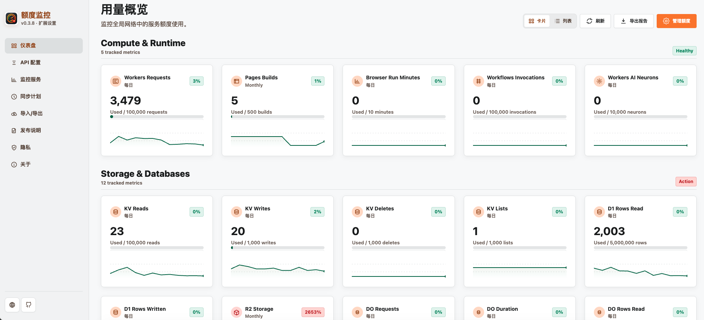

# Cloudflare Free Quota Monitor

Chrome MV3 extension for monitoring Cloudflare free-tier usage from a compact popup and a unified settings workspace for dashboard, credentials, local config import/export, privacy, service coverage, schedule, and About information.

The UI follows the Google Stitch "Professional Modern Light" direction included in `google-stitch/`: white and light gray surfaces, Cloudflare orange accents, compact cards, and dense operational data.

## Preview



## Links

- Website: https://cloudflare-quota-monitor.thesignalwise.com/
- Chrome Web Store: https://chromewebstore.google.com/detail/cloudflare-free-quota-monitor/ohdjecmdkcmghmlcmmhlimpjllgceejp
- Source: https://github.com/thesignalwise/cloudflare-quota-monitor

## What It Monitors

The extension reads Cloudflare usage through the public GraphQL Analytics API plus the Pages REST API. Unsupported counters are displayed as unavailable instead of being shown as a false zero.

| Service | Metrics | API source | Status |
| --- | --- | --- | --- |
| Workers | Requests | `workersInvocationsAdaptive.sum.requests` | Validated |
| Pages | Monthly deployments/builds | Pages REST projects and deployments | Validated |
| Workers KV | Reads, writes, deletes, lists | `kvOperationsAdaptiveGroups` by `actionType` | Validated |
| D1 | Rows read, rows written | `d1AnalyticsAdaptiveGroups.sum` | Validated |
| R2 | Storage, Class A ops, Class B ops | `r2StorageAdaptiveGroups`, `r2OperationsAdaptiveGroups` | Validated |
| Queues | Billable operations | `queueMessageOperationsAdaptiveGroups.sum.billableOperations` | Validated |
| Hyperdrive | Queries | `hyperdriveQueriesAdaptiveGroups.count` | Validated |
| Browser Run | Browser minutes | `browserRenderingBrowserTimeUsageAdaptiveGroups.sum.totalSessionDurationMs` | Validated |
| Workers Logs | Ingestion bytes; event quota marked unavailable | `logExplorerIngestionAdaptiveGroups.sum` | Partial |
| Analytics Engine | Data points written; read queries marked unavailable | `workersAnalyticsEngineAdaptiveGroups.count` | Partial |
| Workflows | Invocations | `workflowsAdaptiveGroups.count` | Validated |
| Workers AI | Neurons | `aiInferenceAdaptiveGroups.sum.totalNeurons` | Validated |
| Durable Objects | Requests, GB-s duration, rows read, rows written, SQL storage | `durableObjects*Groups` | Validated |

## Free-Tier Limits

Quota constants live in `background.js`. They are based on current Cloudflare documentation:

- Workers requests: 100,000/day ([Workers limits](https://developers.cloudflare.com/workers/platform/limits/)).
- Pages builds: 500/month ([Pages limits](https://developers.cloudflare.com/pages/platform/limits/)).
- KV, Hyperdrive, D1, Durable Objects, R2, Workers Logs: Cloudflare Workers pricing docs ([Workers pricing](https://developers.cloudflare.com/workers/platform/pricing/)).
- R2 operation classes and free tier: [R2 pricing](https://developers.cloudflare.com/r2/pricing/).
- Browser Run: 10 minutes/day ([Browser Run limits](https://developers.cloudflare.com/browser-run/limits/)).
- Analytics Engine: 100,000 data points/day and 10,000 read queries/day ([Analytics Engine pricing](https://developers.cloudflare.com/analytics/analytics-engine/pricing/)).
- Workflows: 100,000 invocations/day shared with Workers requests ([Workflows pricing](https://developers.cloudflare.com/workflows/reference/pricing/)).
- Workers AI: 10,000 neurons/day ([Workers AI pricing](https://developers.cloudflare.com/workers-ai/platform/pricing/)).

## API Token

Create a Cloudflare API token with read-only access for the products you want to monitor. The tested token used these permissions:

- Account Analytics: Read
- Cloudflare Pages: Read
- Workers Scripts: Read
- Workers KV Storage: Read
- Workers R2 Storage: Read
- D1: Read
- Queues: Read
- Hyperdrive: Read
- Zero Trust: Read
- User Details: Read
- Memberships: Read

The token and account ID are stored in `chrome.storage.local` by the extension. Local config export is optional and downloads a JSON file that includes sensitive settings plus cached quota and history data. Local integration tests read credentials from `.env`.

## Privacy And Permissions

The extension is local-first and has no backend service. It sends the Cloudflare API token only to `https://api.cloudflare.com/` for token verification and read-only telemetry.

Default permissions:

- `storage`: save settings and cached quota data locally.
- `alarms`: refresh quota data on a daily schedule.
- `notifications`: notify quota risk when applicable.
- `https://api.cloudflare.com/*`: verify tokens and read Cloudflare telemetry.

No broad optional host permissions are requested for backup. Configuration import/export is local file based.

Privacy surfaces:

- `privacy.html`: extension-bundled privacy policy and Limited Use disclosure.
- `PRIVACY.md`: website-ready privacy policy text for publishing on an external page.
- `webdav.html`: local JSON import/export with a visible warning that exported files contain the API token, account ID, latest quota cache, and dashboard history.

## Local Environment

Create a local environment file:

```sh
cp .env.sample .env
```

Then fill in:

```sh
CLOUDFLARE_API_TOKEN=cfut_replace_with_your_token
CLOUDFLARE_ACCOUNT_ID=replace_with_your_account_id
```

`.env` is ignored by git. `.env.sample` is tracked as the template.

## Interface

- Popup: dense mini-card cockpit sorted by usage pressure. It highlights the highest percentage first, then shows critical/watch/tracked counters and compact metric cards.
- Dashboard: now lives inside the same sidebar workspace as the other settings pages. It is grouped by Compute & Runtime, Storage & Databases, Messaging & Data Plane, and Analytics & Logs. Use the Cards/List toggle to switch between visual cards and a scan-friendly list.
- Settings pages: sidebar navigation starts with the primary dashboard, then configuration and monitoring controls, followed by support pages: `dashboard.html`, `options.html`, `services.html`, `schedule.html`, `webdav.html`, `release-notes.html`, `privacy.html`, and `about.html`. Sidebar footer uses icon-only links for the official website and GitHub repository.
- Internationalization: UI defaults to the browser language and supports Simplified Chinese, Traditional Chinese, English, Japanese, and Korean. A manual language selector is available on the About page.

## Install In Chrome

Install the published extension from the Chrome Web Store:

- https://chromewebstore.google.com/detail/cloudflare-free-quota-monitor/ohdjecmdkcmghmlcmmhlimpjllgceejp

For local development, load the unpacked extension:

1. Open `chrome://extensions/`.
2. Enable Developer mode.
3. Click Load unpacked.
4. Select this repository directory.
5. Open the extension Options page and enter the API token and account ID.
6. Save, then use Refresh in the popup or dashboard.

## Development

Run syntax and integration tests:

```sh
npm test
```

The integration checks are skipped if `.env` is missing. With `.env` present, tests verify:

- Cloudflare token status and account access.
- R2 returns non-zero storage for the configured account.
- Every tracked GraphQL dataset returns without schema errors.
- Pages REST project listing works.

Create a Chrome Web Store-ready ZIP package:

```sh
npm run package
```

The package script allowlists extension runtime files and excludes `.env`, screenshots, tests, `google-stitch/`, and other local-only material. Output is written to `dist/cloudflare-quota-monitor-<version>.zip`.

## Known API Gaps

Cloudflare currently exposes Workers Logs ingestion bytes through GraphQL, but not the exact "Log Events Written" quota counter. Analytics Engine exposes data points written, but not read-query usage. The UI marks these exact quota rows as Not available and still shows available supporting telemetry where possible.

## Project Files

- `background.js`: data collection, quota constants, storage cache, alarm refresh.
- `popup.html`, `popup.js`: high-density popup cockpit with attention-first mini cards.
- `dashboard.html`, `dashboard.js`: sidebar-integrated grouped dashboard with card and list modes.
- `options.html`: Cloudflare API credentials.
- `webdav.html`: local configuration and monitoring history import/export.
- `services.html`: monitored service coverage.
- `schedule.html`: refresh cadence.
- `about.html`: logo, version, privacy, language, and API coverage notes.
- `privacy.html`, `PRIVACY.md`: bundled and website-ready privacy policy.
- `release-notes.html`: changelog and release notes.
- `i18n.js`, `_locales/`: runtime page translations and Chrome extension metadata translations.
- `options.js`: shared settings persistence for all settings pages.
- `style.css`: shared Google Stitch-inspired light design system.
- `tests/extension.test.js`: Node test runner checks.
- `scripts/package-extension.mjs`: deterministic Chrome extension package builder.
